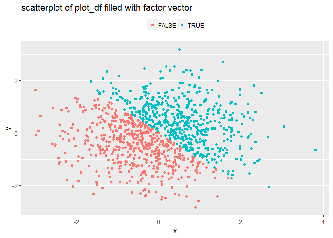

p8105\_hw1\_cy2522
================
Chu Yu

Problem 1
=========

Start with a data frame
-----------------------

``` r
# data frame
library(tidyverse)
```

    ## -- Attaching packages ---------------------------------------------- tidyverse 1.2.1 --

    ## √ ggplot2 3.0.0     √ purrr   0.2.5
    ## √ tibble  1.4.2     √ dplyr   0.7.6
    ## √ tidyr   0.8.1     √ stringr 1.3.1
    ## √ readr   1.1.1     √ forcats 0.3.0

    ## -- Conflicts ------------------------------------------------- tidyverse_conflicts() --
    ## x dplyr::filter() masks stats::filter()
    ## x dplyr::lag()    masks stats::lag()

``` r
set.seed(1)

df_1 = tibble(
num_1 = runif(10,0,5),
logic_1 = c(num_1 > 2),
char_1 = c("this", "is", "my", "first", "home", "work", "problem", "of", "data", "science" ),
fac_1 = factor(c("a", "b", "c", "d", "e", "f", "g", "h", "i", "x"))
)

# mean
mean(df_1$num_1)      
```

    ## [1] 2.757569

``` r
mean(df_1$logic_1)
```

    ## [1] 0.6

``` r
mean(df_1$char_1)       
```

    ## Warning in mean.default(df_1$char_1): argument is not numeric or logical:
    ## returning NA

    ## [1] NA

``` r
mean(df_1$fac_1)
```

    ## Warning in mean.default(df_1$fac_1): argument is not numeric or logical:
    ## returning NA

    ## [1] NA

``` r
# means of the character vector and the  factor vector are NA.The means of them are regarded as missing value because they can not be calculated.
summary(df_1)
```

    ##      num_1         logic_1           char_1              fac_1  
    ##  Min.   :0.3089   Mode :logical   Length:10          a      :1  
    ##  1st Qu.:1.4608   FALSE:4         Class :character   b      :1  
    ##  Median :3.0049   TRUE :6         Mode  :character   c      :1  
    ##  Mean   :2.7576                                      d      :1  
    ##  3rd Qu.:4.1950                                      e      :1  
    ##  Max.   :4.7234                                      f      :1  
    ##                                                      (Other):4

'as.numeric' function
---------------------

``` r
# as.numeric

as.numeric(df_1$num_1)
as.numeric(df_1$logic_1)
as.numeric(df_1$char_1)
as.numeric(df_1$fac_1)
```

converting
----------

``` r
# convert the characters:

char_fac_1 <- as.factor(df_1$char_1)
char_fac_1  
```

    ##  [1] this    is      my      first   home    work    problem of     
    ##  [9] data    science
    ## Levels: data first home is my of problem science this work

``` r
## when converted into factors, the charactors does not change much. The order of words changed by the initial letter.  

fac_num_1 <- as.numeric(char_fac_1)
fac_num_1
```

    ##  [1]  9  4  5  2  3 10  7  6  1  8

``` r
## they change into numbers 

# convert the factors:

fac_char_1 <- as.character(df_1$fac_1)
fac_char_1
```

    ##  [1] "a" "b" "c" "d" "e" "f" "g" "h" "i" "x"

``` r
## the words looks the same, but change into charactors.

char_num_1 <- as.numeric(fac_char_1)
```

    ## Warning: 强制改变过程中产生了NA

``` r
char_num_1
```

    ##  [1] NA NA NA NA NA NA NA NA NA NA

``` r
## the value can not be obtained, meaning that charactors can not be converted into numbers, but factors can.
```

Problem 2
=========

start with a data frame
-----------------------

``` r
# set the data frame

set.seed(1)
x <- rnorm(1000)

set.seed(4)
y <- rnorm(1000)

logic_2 <- c(x + y > 0)
num_2 <- as.numeric(logic_2)
fac_2 <- as.factor(logic_2)

plot_df <- data.frame(x, y, logic_2, num_2, fac_2)

# description of the data frame

##  the size of the dataset 
dim(plot_df)
```

    ## [1] 1000    5

``` r
##  mean and median
summary(plot_df)
```

    ##        x                  y             logic_2            num_2      
    ##  Min.   :-3.00805   Min.   :-2.83958   Mode :logical   Min.   :0.000  
    ##  1st Qu.:-0.69737   1st Qu.:-0.66608   FALSE:504       1st Qu.:0.000  
    ##  Median :-0.03532   Median :-0.03979   TRUE :496       Median :0.000  
    ##  Mean   :-0.01165   Mean   :-0.03443                   Mean   :0.496  
    ##  3rd Qu.: 0.68843   3rd Qu.: 0.63505                   3rd Qu.:1.000  
    ##  Max.   : 3.81028   Max.   : 3.17419                   Max.   :1.000  
    ##    fac_2    
    ##  FALSE:504  
    ##  TRUE :496  
    ##             
    ##             
    ##             
    ## 

``` r
## proportion
propTRUE_plot_df <- prop.table(table(plot_df$logic_2))
propTRUE_plot_df
```

    ## 
    ## FALSE  TRUE 
    ## 0.504 0.496

scatterplots
------------

``` r
library(ggplot2)

# scatterplot 1 -- logic vector
ggplot(plot_df, aes(x = x, y = y, colour = logic_2)) +
  geom_point() +
  scale_fill_manual(values = c("blue", "red"),
                    labels = expression("x + y < 0", "x + y > 0")) +
  labs( x = "x", y = "y", title = "scatterplot of plot_df filled with logic vector") +
  theme(legend.position = "top", legend.title = element_blank()) 
```


``` r
ggsave("scatterplots1_hw1.pdf", width = 7, height = 7)

# scatterplot 2 -- numeric vector
ggplot(plot_df, aes(x = x, y = y, colour = num_2)) +
  geom_point() +
  scale_fill_manual(values = c("blue", "red"),
                    labels = expression("x + y < 0", "x + y > 0")) +
  labs( x = "x", y = "y", title = "scatterplot of plot_df filled with numeric vector") +
  theme(legend.position = "top", legend.title = element_blank()) 
```


``` r
# scatterplot 3 -- factor vector
ggplot(plot_df, aes(x = x, y = y, colour = fac_2)) +
  geom_point() +
  scale_fill_manual(values = c("blue", "red"),
                    labels = expression("x + y < 0", "x + y > 0")) +
  labs( x = "x", y = "y", title = "scatterplot of plot_df filled with factor vector") +
  theme(legend.position = "top", legend.title = element_blank()) 
```


